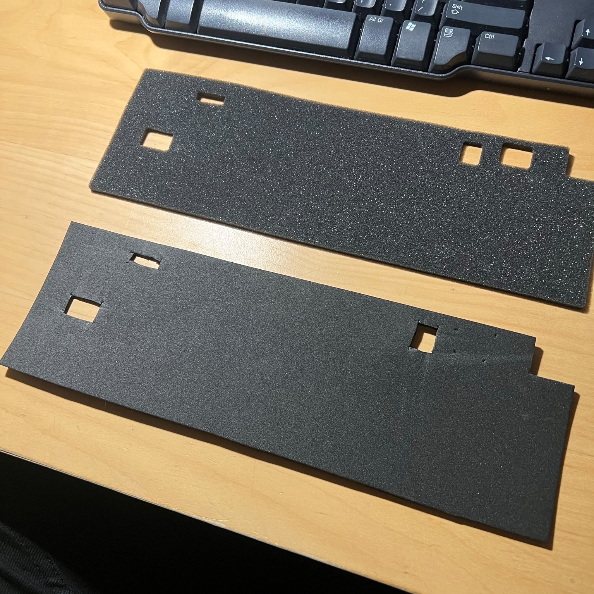

# Custom keyboard mini project
So basically the spacebar in my last keyboard stopped working which inspired me to finally make a custom mechanical keyboard.

## Search for parts
After some research and reading on mechanical keyboard forums I found some polish shops selling keyboard accessories.  
During browsing a lot of products I finally managed to pick some board cases and switches that I'd like.  
I settled on the parts listed below

Case                  |  Switches                  |  Keycaps
:---------------------|:---------------------------|:------------------------
GMK67                 |  Gateron Milky Browns      |  "Soy Milk" PBT Cherry
  |    |    
I chose this case because its quite inexspensive for the mechanical keyboard community standards and also I like its small size and 3 modes of connectivity             |  I chose the browns because I don't really like linear switches, and hate loud clicky switches. The tactile browns are a good middleground between the two extremes      |  I couldn't really find keycaps that would be 10/10 for me from polish vendors so I settled on these cute neutral white-beige keycaps. These are made of PBT and are Cherry profile

## Assembly
The keyboard was super satisfying to assemble. I decided to do a tape mod and eva foam mod for deeper and thockier sound.  

Parts                                |  Size comparison                         |  Eva foam 
:-----------------------------------:|:----------------------------------------:|:---------------------------------------------------------------------:
                |           |  
All of the parts next to each other  |  GMK67 compared to my old Dell keyboard  |  Photo of my 3mm eva foam (bottom) compared to the original foam (top) 

Unfortunately I didn't take any photos of the tape mod which is a shame :<  
  
## Finished product  
I honestly think it looks really cool and it sounds AMAZING. I could listen to it all day...

View from top                   |  View from the side
:------------------------------:|:-------------------------:
    |  
